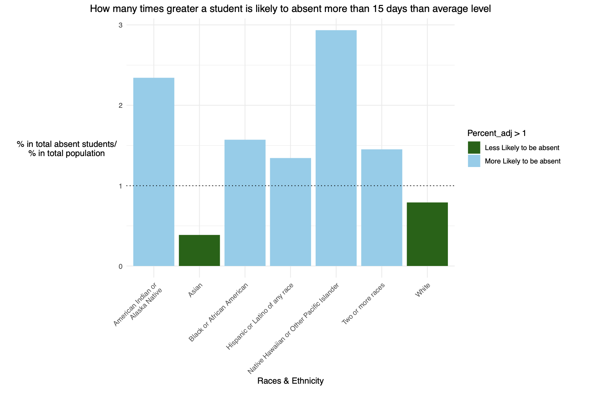

## **Student Absenteeism Analysis Report**

### **Project Outline**
This project explores the causes and patterns of **student absenteeism** across various demographics (race, gender, and regions). By analyzing data on students absent for 15+ days in public schools, we identify trends and key factors contributing to chronic absenteeism.

### **Methodology**
1. **Data Preparation**:
Raw data and clean data can be veiwed in the data folder.
   - Raw data sourced from [data.gov](https://catalog.data.gov/dataset/student-absenteeism-b0fcc).
   - Cleaned and structured datasets into three sheets for **total**, **male**, and **female** student groups.

2. **Data Analysis**:
   - Visualizations were created to compare absenteeism rates among **race/ethnicity**, **states**, and **genders**.
   - Racial population structures are considered during the process.

3. **Statistical Models**:
   - **Regression models** were used to analyze the significance of factors like race, gender, and state.

### **Brief Data Description**
The dataset includes:
- **Class_all**: Student group (Race/Ethnicity).
- **State**: U.S. state or national data.
- **Number**: Absolute number of students absent for 15+ days.
- **Percentage**: Percentage of students absent relative to total students in a group.

#### Example Data:
| Class_all                        | State         | Number  | Percent |
|----------------------------------|---------------|---------|---------|
| American Indian or Alaska Native | United States | 110,372 | 1.63970 |
| American Indian or Alaska Native | Alabama       | 992     | 1.08180 |
| American Indian or Alaska Native | Alaska        | 9,501   | 32.34270|
| American Indian or Alaska Native | Arizona       | 13,168  | 7.36140 |

### **Key Findings**
- **Top Affected Groups**:  
   Native Hawaiian or Other Pacific Islander and Native Americans students have the highest absenteeism rates relative to their population size. Then follows the  Black or African American and Hispanic or Latiino of any race.
  
 
- **State-Specific Challenges**:
   States like **Alaska, Connecticut, Minnesota, Nerbraska**, and **Washington** face high absenteeism rates among specific racial groups.
- **Gender Impact**:  
   Gender showed **no significant effect** on absenteeism rates.
- **Statistical Insights**:  
   Regression analysis highlights **race/ethnicity** as a more significant factor than state-level differences.

### **Contact Information**
**Authors**:  
- Ruiyan Tang  
- Putri Othman  
- Nurnayli  

**Email**: rft5253@psu.edu
